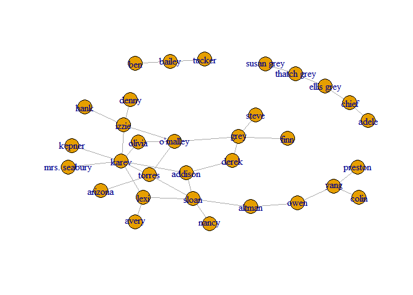
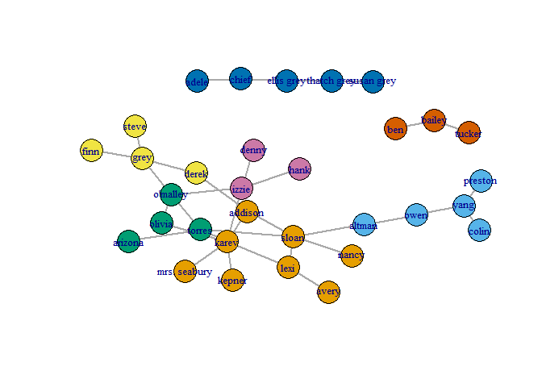
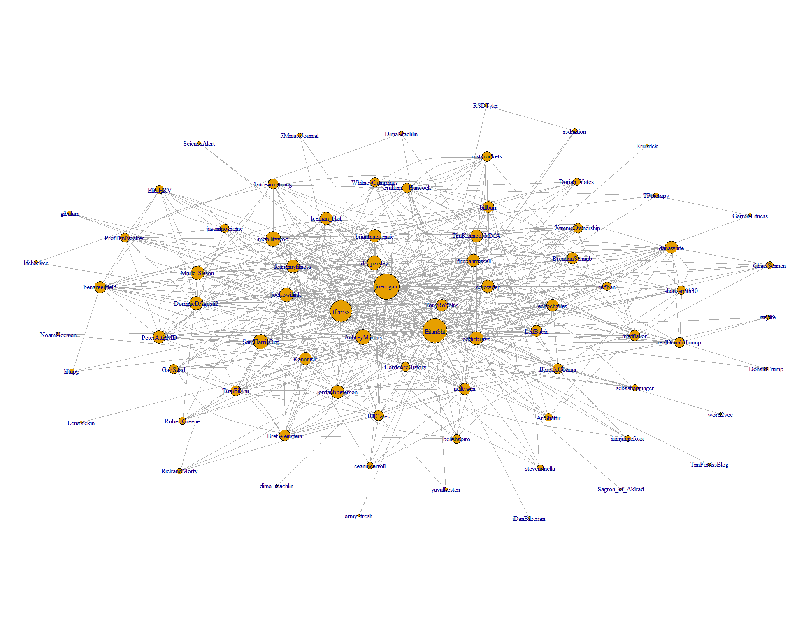

``` r
# Read the data from the file
library(igraph)
```

    ## 
    ## Attaching package: 'igraph'

    ## The following objects are masked from 'package:stats':
    ## 
    ##     decompose, spectrum

    ## The following object is masked from 'package:base':
    ## 
    ##     union

``` r
ga.data <- read.csv('termDocMatrix\\ga_edgelist.csv', header = T)
g <- graph.data.frame(ga.data,directed = F)
```

``` r
# Plot the initial graph
plot(g, vertex.size=10, asp=FALSE)
```



``` r
# Calculate the max betweeness
message("Max Betweeness\n")
```

    ## Max Betweeness

``` r
betweenness = betweenness(g)
highest_bet = which.max(betweenness)
betweenness[highest_bet]
```

    ##    sloan 
    ## 115.3667

``` r
# Calculate the max closeness
message("Max Closeness\n")
```

    ## Max Closeness

``` r
closeness = closeness(g)
highest_clo = which.max(closeness)
closeness[highest_clo]
```

    ##      torres 
    ## 0.003194888

``` r
# Calculate the max Eigen-vector
message("Max EigenVector\n")
```

    ## Max EigenVector

``` r
eigen = eigen_centrality(g)
list_eigen = eigen[1]
highest_eig = which.max(as.numeric(unlist(list_eigen)))
vec_eig = list_eigen[[1]]
vec_eig[highest_eig]
```

    ## karev 
    ##     1

Girvan-Newman community detection

``` r
message("Girvan-Newman community detection")
```

    ## Girvan-Newman community detection

``` r
gc_gn =  edge.betweenness.community(g)
```

``` r
# Calculate the communities details
memb_gn <- membership(gc_gn)
df_gn = data.frame(sizes(gc_gn))
colnames(df_gn) <- c("Community", "Size")
df_gn
```

    ##   Community Size
    ## 1         1    8
    ## 2         2    5
    ## 3         3    4
    ## 4         4    4
    ## 5         5    5
    ## 6         6    3
    ## 7         7    3

``` r
# Calculate the max modularity
modularity_gn = gc_gn$modularity
max_modularity_gn = max(modularity_gn)
message("Modularity:\n")
```

    ## Modularity:

``` r
modularity_gn
```

    ##  [1] -0.04584775 -0.01773356  0.01081315  0.03849481  0.06617647
    ##  [6]  0.09472318  0.12326990  0.14965398  0.17560554  0.20285467
    ## [11]  0.23096886  0.25865052  0.28633218  0.31358131  0.34083045
    ## [16]  0.36894464  0.39576125  0.41479239  0.44247405  0.46712803
    ## [21]  0.49134948  0.50778547  0.52681661  0.54974048  0.57050173
    ## [26]  0.57742215  0.56098616  0.53416955  0.45804498  0.30449827

``` r
message("\nMax Modularity:\n")
```

    ## 
    ## Max Modularity:

``` r
max_modularity_gn
```

    ## [1] 0.5774221

``` r
# Plots the graph
plot(g, vertex.size=12, vertex.label.font=6, vertex.label.cex=0.8, edge.width=2, vertex.color=memb_gn, asp=FALSE)
```



Walktrap community detection

``` r
message("Walktrap community detection")
```

    ## Walktrap community detection

``` r
gc_wt =  walktrap.community(g)
```

``` r
# Calculate the communities details
memb_wt <- membership(gc_wt)
df_wt = data.frame(sizes(gc_wt))
colnames(df_wt) <- c("Community", "Size")
df_wt
```

    ##   Community Size
    ## 1         1    5
    ## 2         2   13
    ## 3         3    3
    ## 4         4    3
    ## 5         5    2
    ## 6         6    3
    ## 7         7    3

``` r
# Calculate the max modularity
modularity_wt = gc_wt$modularity
max_modularity_wt = max(modularity_wt)
message("Modularity:\n")
```

    ## Modularity:

``` r
modularity_wt
```

    ##  [1]  0.00000000 -0.01730106  0.01081313  0.03676469  0.06487888
    ##  [6]  0.09256054  0.12024221  0.14749134  0.17387544  0.19982699
    ## [11]  0.22837371  0.25692043  0.28460205  0.31185120  0.33910033
    ## [16]  0.36678201  0.39489621  0.42171276  0.44939446  0.45544982
    ## [21]  0.48226649  0.47923881  0.49567476  0.48875433  0.49394464
    ## [26]  0.51470590  0.48269898  0.50562286  0.45804498  0.30449831
    ## [31]  0.00000000  0.00000000

``` r
message("\nMax Modularity:\n")
```

    ## 
    ## Max Modularity:

``` r
max_modularity_wt
```

    ## [1] 0.5147059

``` r
# Plot the graph
plot(g, vertex.size=12, vertex.label.font=6, vertex.label.cex=0.8, edge.width=2, vertex.color=memb_wt, asp=FALSE)
```


Twitter Network Analysis
------------------------

In this assignment we will analyze the Twitter account of Eitan Shteinberg (@Eitansht) - one of the students. The process with gather the user details and then iterate over each of his friends. Each friend's details are kept and connections between the friends themselves are established. An initial graph will be plotted and then all the calculations will be applied using Walktrap algorithm. An analyzed colored, size factored graph of the sub-communities is plotted.

### Data:

Vertices Friends (Twitter users) Edges Friendship between users

### Steps of implementation:

1.  Get the keys from a a file (encapsulation)
2.  Set the user we will analyze & max threshold friends of each other user
3.  Start gathering information of all the friends & their friends, only those who have friends
4.  Save the data to the disc (really long process because of Twitter's policy)
5.  Load the data from the disc
6.  Plot the initial graph with the user himself
7.  Analyze the communities with Walktrap
8.  Display max betweeness, closeness & eigen-vector
9.  Display the community sizes
10. Calculate max modularity
11. Plot the analyzed graph with the sub-communities by color without the user

### Usage:

In this assignment we used the twitteR, igraph & rio packages.

``` r
# Loading login details to a dataframe
saved_df <- read.table("login_details.txt",header=FALSE)
colnames(saved_df) <- c("Parameter", "Value")
```

``` r
# Assigning the login details to variables
library(twitteR)
library(igraph)
library(rio)

setup_twitter_oauth(
  consumer_key=saved_df$Value[1], 
  consumer_secret=saved_df$Value[2], 
  access_token=saved_df$Value[3], 
  access_secret=saved_df$Value[4]
)
```

    ## [1] "Using direct authentication"

``` r
# Defining the Twitter account to analyze
my.name <- "EitanSht"

# Defining threshold of number of friends to each friend
friends.threshold <- 5000
```

``` r
# # Extract user details, user's friends & followers
# me <- getUser(my.name)
# my.friends <- me$getFriends()
# my.friends <- twListToDF(my.friends)
# my.followers <- me$getFollowers()
# my.followers <- twListToDF(my.followers)
# 
# # initialize data scraping
# twitter.bubble <- data.frame(
#   friend = my.friends$screenName,
#   follower = my.name,
#   N = me$followersCount,
#   loc = me$location,
#   stringsAsFactors = FALSE
# )
# 
# skipped.friends <- NULL
# 
# # Loop over the friends
# for (friend.name in my.friends$screenName) {
#   # Get the friends data
#   friend <- getUser(friend.name, retryOnRateLimit = 180)
#   
#   # Skip those that follow more than the threshold users
#   if (friend$friendsCount > friends.threshold) {
#     message(paste("*** skipping", friend.name, " (too many friends) ***"))
#     skipped.friends <- append(skipped.friends, friend.name)
#     next
#   } else {
#     message(friend.name)
#   }
#   
#   # Get the friends of the friend
#   friend.friends <- friend$getFriends(retryOnRateLimit = 180)
#   
#   # Evaluate only those that have any friends
#   if (length(friend.friends) > 0) {
#     friend.friends <- twListToDF(friend.friends)
#     
#     # Insert a connection for those friends that are also in the user's friends
#     common.friends <-
#       intersect(c(my.friends$screenName, my.name),
#                 friend.friends$screenName)
#     if (length(common.friends) > 0)
#       twitter.bubble <- rbind(
#         twitter.bubble,
#         data.frame(
#           friend = common.friends,
#           follower = friend.name,
#           N = friend$followersCount,
#           loc = friend$location,
#           stringsAsFactors = FALSE
#         )
#       )
#   }
# }
```

``` r
# # Dataframe for the colors
# followersCount <- twitter.bubble[!duplicated(twitter.bubble[, c(2,3)]), c(2,3)]
# 
# # Include those not evaluated so far due to too many friends
# for (friend.name in setdiff(my.friends$screenName, followersCount$follower)) {
#   friend <- getUser(friend.name, retryOnRateLimit=180)
#   followersCount <- rbind(followersCount, data.frame(follower=friend.name, N=friend$followersCount), stringsAsFactors=FALSE)
# }
# 
# # Save the variables to disc
# save(file=paste("twitter_eitan", format(Sys.time(), "%Y%m%d"),".RData", sep=""), my.name, my.friends, twitter.bubble, skipped.friends, followersCount)
```

``` r
# Load the variables from the disc
library(viridis)
```

    ## Loading required package: viridisLite

``` r
load("twitter_eitan.RData")
```

``` r
# Plot all the raw data
g <- graph.edgelist(as.matrix(twitter.bubble[, c(1, 2)]), directed = FALSE)

# Plot's layout
layout <-
  layout_with_lgl(
    g,
    maxiter = 1000,
    area = length(V(g)) ^ 3.5,
    repulserad = length(V(g)) ^ 5.5
  )

# Draw the plot
plot(
  g,
  layout = layout,
  # vertex.label="",
  vertex.size = 0.1 + 0.75 * sqrt(graph.strength(g)),
  edge.width = 0.01,
  asp = 9 / 16,
  margin = -0.1
)
```



``` r
# Communities analysis with removing the dedicated user
twitter.bubble <- subset(twitter.bubble, friend!=my.name & follower!=my.name)

# Walktrap communities analysis
message("Walktrap community detection")
```

    ## Walktrap community detection

``` r
g_twitter <- graph.edgelist(as.matrix(twitter.bubble[,c(1,2)]), directed=FALSE)
E(g_twitter)$weight <- edge.betweenness(g_twitter)
gc_wt <- walktrap.community(g_twitter, steps=31)
message("Communities\n")
```

    ## Communities

``` r
print(communities(gc_wt))
```

    ## $`1`
    ## [1] "TPtherapy"     "GarminFitness"
    ## 
    ## $`2`
    ##  [1] "Graham__Hancock" "AubreyMarcus"    "AriShaffir"     
    ##  [4] "redban"          "BrendanSchaub"   "madflavor"      
    ##  [7] "duncantrussell"  "TimKennedyMMA"   "RobertGreene"   
    ## [10] "bengreenfield"   "foundmyfitness"  "SamHarrisOrg"   
    ## [13] "Iceman_Hof"      "joerogan"        "tferriss"       
    ## [16] "rustyrockets"    "shanesmith30"    "ChaelSonnen"    
    ## [19] "scrowder"        "billburr"        "BretWeinstein"  
    ## [22] "GadSaad"         "benshapiro"      "Mark_Sisson"    
    ## [25] "stevenrinella"   "Dorian_Yates"    "iamjamiefoxx"   
    ## [28] "WhitneyCummings" "sebastianjunger" "neiltyson"      
    ## [31] "HardcoreHistory" "jockowillink"    "TomBilyeu"      
    ## [34] "DominicDAgosti2" "gibalam"         "XtremeOwnership"
    ## [37] "5MinuteJournal"  "docparsley"      "ProfTimNoakes"  
    ## [40] "brianmackenzie"  "jasonmooreme"    "EliteHRV"       
    ## [43] "ScienceAlert"    "liftapp"        
    ## 
    ## $`3`
    ## [1] "eddiebravo"      "elonmusk"        "danawhite"       "realDonaldTrump"
    ## [5] "RickandMorty"    "DonaldTrump"     "rstylife"        "NoamNeeman"     
    ## 
    ## $`4`
    ## [1] "jordanbpeterson" "BillGates"       "PeterAttiaMD"    "seanmcarroll"   
    ## [5] "echocharles"     "LeifBabin"       "yuvalkesten"    
    ## 
    ## $`5`
    ## [1] "lancearmstrong" "mobilitywod"   
    ## 
    ## $`6`
    ## [1] "BarackObama"
    ## 
    ## $`7`
    ## [1] "TonyRobbins"
    ## 
    ## $`8`
    ## [1] "rsdnation"
    ## 
    ## $`9`
    ## [1] "RSDTyler"
    ## 
    ## $`10`
    ## [1] "lifehacker"
    ## 
    ## $`11`
    ## [1] "DimaMachlin"

``` r
# Calculate the max betweeness
message("Max Betweeness\n")
```

    ## Max Betweeness

``` r
betweenness = betweenness(g_twitter)
highest_bet = which.max(betweenness)
betweenness[highest_bet]
```

    ## jockowillink 
    ##          217

``` r
# Calculate the max closeness
message("Max Closeness\n")
```

    ## Max Closeness

``` r
closeness = closeness(g_twitter)
highest_clo = which.max(closeness)
closeness[highest_clo]
```

    ## Iceman_Hof 
    ## 0.00056622

``` r
# Calculate the max eigen-vector
message("Max EigenVector\n")
```

    ## Max EigenVector

``` r
eigen = eigen_centrality(g_twitter)
list_eigen = eigen[1]
highest_eig = which.max(as.numeric(unlist(list_eigen)))
vec_eig = list_eigen[[1]]
vec_eig[highest_eig]
```

    ## joerogan 
    ##        1

``` r
# Communities details
memb_wt <- membership(gc_wt)
message("Number of communities: ", length(sizes(gc_wt)))
```

    ## Number of communities: 11

``` r
df_wt = data.frame(sizes(gc_wt))
colnames(df_wt) <- c("Community", "Size")
df_wt
```

    ##    Community Size
    ## 1          1    2
    ## 2          2   44
    ## 3          3    8
    ## 4          4    7
    ## 5          5    2
    ## 6          6    1
    ## 7          7    1
    ## 8          8    1
    ## 9          9    1
    ## 10        10    1
    ## 11        11    1

``` r
# Max modularity
modularity_wt = gc_wt$modularity
max_modularity_wt = max(modularity_wt)
message("Modularity:\n")
```

    ## Modularity:

``` r
modularity_wt
```

    ##  [1]  0.000000e+00 -4.143733e-02 -4.109700e-02 -4.074091e-02 -4.035775e-02
    ##  [6] -3.995870e-02 -3.951929e-02 -3.904375e-02 -3.897952e-02 -3.866015e-02
    ## [11] -3.840539e-02 -3.761548e-02 -3.724413e-02 -3.711311e-02 -3.708696e-02
    ## [16] -3.580859e-02 -3.405985e-02 -3.344821e-02 -3.275214e-02 -3.406497e-02
    ## [21] -3.398333e-02 -3.303801e-02 -3.303253e-02 -2.914763e-02 -2.979504e-02
    ## [26] -2.904674e-02 -2.301941e-02 -1.001165e-02 -7.765417e-03 -2.233127e-03
    ## [31] -2.057429e-03 -1.733564e-03  9.437008e-03  1.975537e-02  1.956656e-02
    ## [36]  1.998455e-02  2.184156e-02  2.972358e-02  2.995944e-02  4.840919e-02
    ## [41]  4.992694e-02  5.718315e-02  6.479716e-02  7.759768e-02  7.964945e-02
    ## [46]  7.968660e-02  7.999501e-02  8.983083e-02  9.153084e-02  9.520778e-02
    ## [51]  9.991770e-02  1.026467e-01  9.997246e-02  1.016414e-01  1.050320e-01
    ## [56]  1.169646e-01  1.193663e-01  1.390283e-01  1.520625e-01  1.190710e-01
    ## [61]  1.141597e-01  8.221176e-02  9.524597e-02  7.650477e-02  8.953899e-02
    ## [66]  7.141921e-02  4.900674e-02  2.520056e-02  6.683550e-07

``` r
message("\nMax Modularity:\n")
```

    ## 
    ## Max Modularity:

``` r
max_modularity_wt
```

    ## [1] 0.1520625

``` r
# Plot the communities graph
par(bg="lightgray")
V(g_twitter)$label.cex = 0.1 + 0.08 * sqrt(graph.strength(g_twitter))
plot(
  g_twitter,
  layout = layout,
  vertex.size = 0.1 + 0.75 * sqrt(graph.strength(g_twitter)),
  vertex.color = memb_wt,
  edge.width = 0.01,
  asp = 9 / 16,
  margin = -0.1
)
```

    ## Warning in layout[, 1] + label.dist * cos(-label.degree) * (vertex.size + :
    ## longer object length is not a multiple of shorter object length

    ## Warning in layout[, 2] + label.dist * sin(-label.degree) * (vertex.size + :
    ## longer object length is not a multiple of shorter object length


